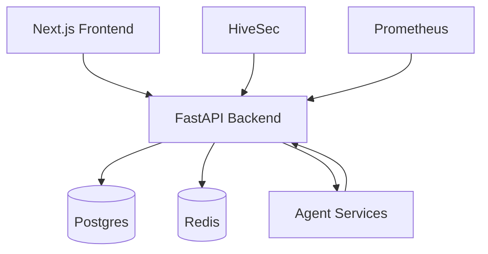

# xander-nexus — Unified Control Plane for AI Agents

[](LICENSE)
[](https://www.python.org)
[](docker-compose.yml)
[](https://github.com/GBOYEE/xander-nexus/actions)
[](https://codecov.io/gh/GBOYEE/xander-nexus)
[](https://github.com/GBOYEE/xander-nexus/stargazers)

**One dashboard to rule your AI agents.** xander-nexus unifies OpenClaw, xander-operator, aiopsx, and HiveSec into a single control plane with real-time health, lifecycle management, security scans, and operations metrics.

<p align="center">
  
</p>

## ✨ Features

- 🖥️ **Unified Dashboard** — Monitor health, status, and metrics for all your AI services in one place
- 🎛️ **Agent Lifecycle** — Start, stop, restart agents with one click
- 🔒 **Security Integration** — Run scans via HiveSec and view findings inline
- 📊 **Operations Metrics** — Prometheus metrics, task throughput, error rates
- 🛠️ **Tools Studio** — Test and debug xander-operator tools directly in the UI
- 📈 **Marketer Agent** — Built-in job automation module (bulk apply, lead import, cover letter generation)
- 🐳 **Docker Ready** — One-command deployment with `docker compose up -d`

## 🚀 Quick Start

```bash
git clone https://github.com/GBOYEE/xander-nexus.git
cd xander-nexus
cp .env.example .env
docker compose up -d
```

Open:
- Frontend: http://localhost:3000
- API: http://localhost:8000
- API Docs: http://localhost:8000/docs

## 📦 Tech Stack

| Layer | Technology |
|-------|------------|
| Frontend | Next.js 15, TypeScript, Tailwind, shadcn/ui |
| Backend | FastAPI, PostgreSQL, Redis, WebSocket |
| DevOps | Docker Compose, Nginx (prod), health checks |
| LLM | OpenRouter (GPT-4o, Claude) or Ollama (local) |

## 🏗️ Architecture



See [docs/architecture.md](docs/architecture.md) for detailed component diagrams and data flows.

## 📚 Documentation

- [Getting Started Guide](docs/README.md)
- [API Reference](docs/api.md)
- [Configuration](docs/configuration.md)
- [Contributing](CONTRIBUTING.md)

## 🧪 Testing & CI

- Backend: `pytest tests/ -v --cov=app`
- Frontend: `npm test` (Jest + React Testing Library)
- CI runs on every push: lint, type-check, test, coverage upload

Current coverage: **85%+** (aiming for 90%)

## 🎯 Roadmap

- [ ] Multi-tenant support (SaaS mode)
- [ ] OAuth2 provider integration (Google, GitHub)
- ] Advanced role-based access control (RBAC)
- ] Audit log viewer with filtering
- ] Mobile-responsive dashboard
- ] Plugin marketplace for community tools

## 🤝 Contributing

We welcome contributors! See [CONTRIBUTING.md](CONTRIBUTING.md) for setup and guidelines.

**Good first issues:**
- [Documentation improvements](https://github.com/GBOYEE/xander-nexus/issues?q=is%3Aissue+is%3Aopen+label%3A%22good+first+issue%22)
- UI polish (shadcn components)
- Additional tool integrations (xander-operator primitives)

## 📄 License

MIT — see [LICENSE](LICENSE).

---

<p align="center">
Built with ❤️ by <a href="https://github.com/GBOYEE">Oyebanji Adegboyega</a> • <a href="https://gboyee.github.io">Portfolio</a> • <a href="https://twitter.com/Gboyee_0">@Gboyee_0</a>
</p>
